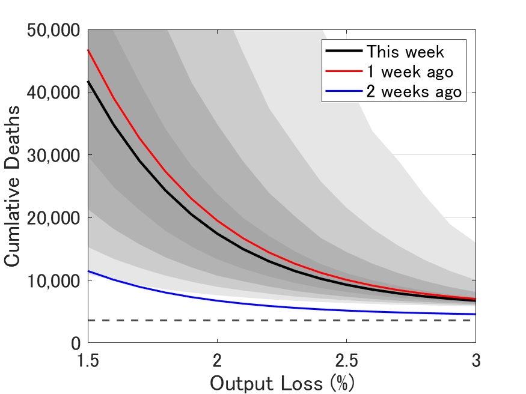
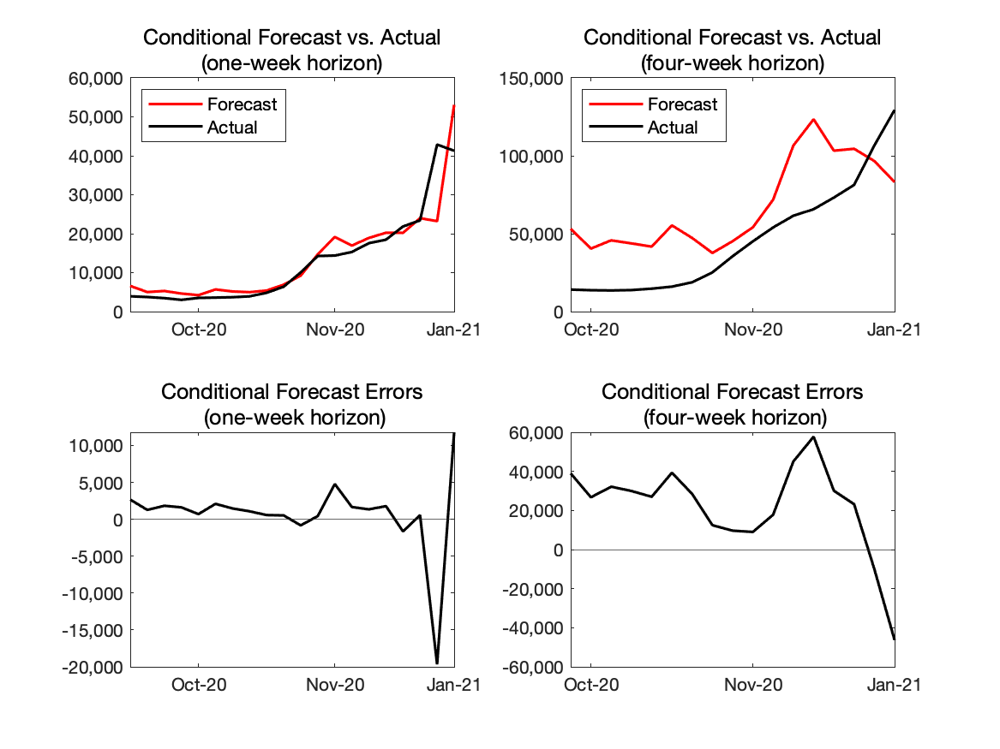
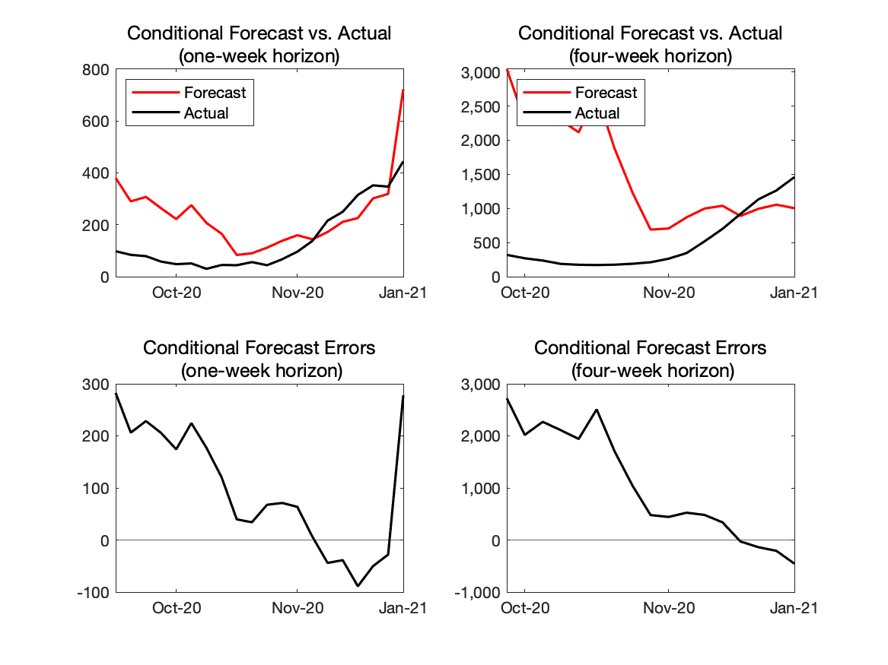

## Last update on January 21, 2021

Replications files are are available [here](https://github.com/Covid19OutputJapan/Covid19OutputJapan.github.io/tree/main/_archives/).

### 1. Conditional Projections of Covid-19

{: align="center"}
||

Source: Authors' calculation. 
Note: Red line:average output loss=1.6%. Black line:average output loss=2%. Blue line:average output loss=3%. Weekly frequency.

### 2. Projected relationship between Covid-19 and output

{: align="center"}
||

Source: Authors' calculation. 
Note: Black line:the most recent week. Red line:one week earlier. Blue line:two weeks earlier. The vertical axis shows the number of cumulative deaths by the end of the next 12 months. The horizontal axis shows the average output loss over the next twelve months. The horizontal dashed line indicates the total number of Covid-19 deaths during 2020. The darkest and the second darkest grey areas indicate 20- and 40-percent confidence sets, respectively. The second lightest and the lightest grey areas indicated 60- and 80-percent confidence sets, respectively. 

### 3. Forecast Errors

#### i. One-week horizon

{: align="center"}
|    | "Conditional" forecast from last week |   Actual |  "Conditional" forecast error |
| ---- | ---- | ---- | ---- |
| **New Cases** | 53,088   |  41,290  | 11,798 |
| **New Deaths** |   723  | 445  | 278 |

Source: Authors' calculation. 
Note: Our model provides projections of Covid-19 conditional on paths of output but does not provide the projection of output. Thus, we compare the actual Covid-19 outcomes with the projection of them if the model had known the realized path of output.  

#### ii. Four-week horizon

{: align="center"}
|    | "Conditional" forecast from 4 weeks ago |   Actual |  "Conditional" forecast error |
| ---- | ---- | ---- | ---- |
| **New Cases** |  83,138  |  129,454  | -46,315 |
| **New Deaths** |   1,004  |    1,459 | -454 |

Source: Authors' calculation. 
Note: Our model provides projections of Covid-19 conditional on paths of output but does not provide the projection of output. Thus, we compare the actual Covid-19 outcomes with the projection of them if the model had known the realized path of output.  

### 4. Real-time Evaluation of the Model's Forecasting Performance

#### New Cases

{: align="center"}
||

Source: Authors' calculation. 
Note: The red lines---"Forecast"---are what the model would have predicted given the data available up to that point.

#### New Deaths

{: align="center"}
||

Source: Authors' calculation. 
Note: The red lines---"Forecast"---are what the model would have predicted given the data available up to that point.

### 5. Chart of the Week

{: align="center"}
||

Source: Authors' calculation. 
Note: The solid black line and grey fan chart are the same as in Chart 2. The red line is the relationship between the output loss and the number of and cumulative deaths if the pace of vaccine distribution is twice as fast as in the baseline case.
