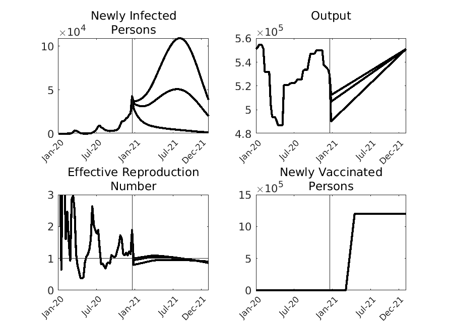
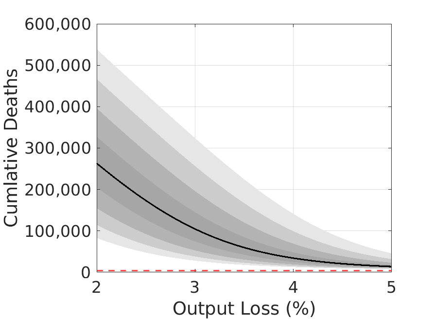
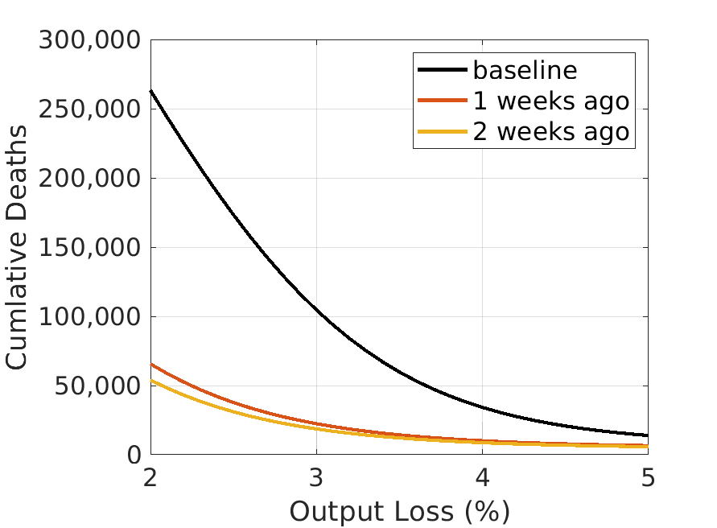
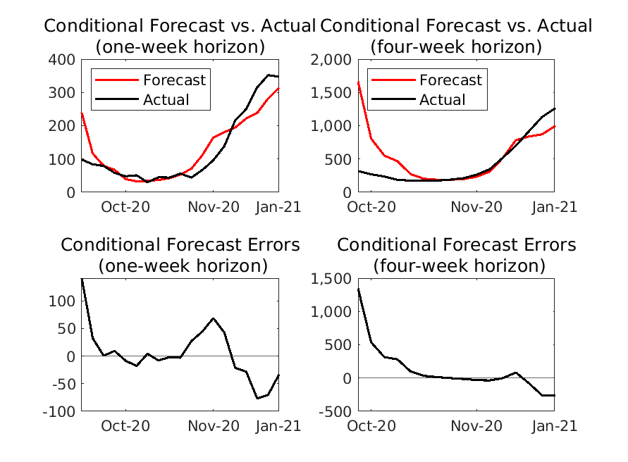
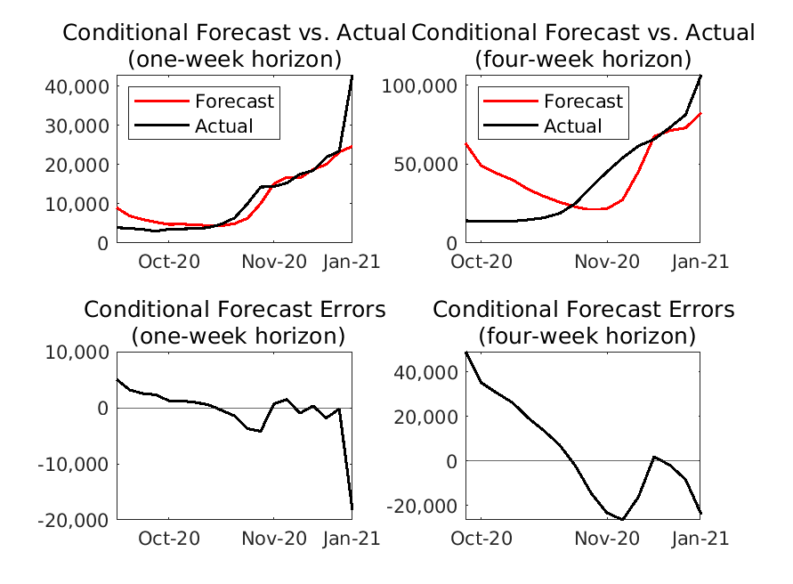

## Updated weekly (Last update on January 20, 2021)

test

The codes and datafiles to generate the figures and tables are available [here](https://github.com/Covid19OutputJapan/Covid19OutputJapan.github.io/tree/main/_archives/).

### 1. Conditional Projections of Covid-19

{: align="center"}
||

Source: Authors’ calculation.

### 2. Projected relationship between Covid-19 and output

{: align="center"}
| |

Source: Authors’ calculation.  Note: The vertical axis shows the number of cumulative deaths by the end of the next 12 months. The horizontal dashed line indicates the total number of Covid-19 deaths during 2020.

### 3. Conditional Forecast Errors

#### New Deaths

{: align="center"}
||

#### New Cases

{: align="center"}
||

#### i. One-week horizon

{: align="center"}
|    | Actual | Forecast  from last week | Forecast Error |
| ---- | ---- | ---- | ---- |
| **New Cases** |  42,882  |  24,646  | -18,236 |
| **New Deaths** |  347  |  314  | -33 |

#### ii. Four-week horizon

{: align="center"}
|    | Actual | Forecast  from 4 weeks ago | Forecast Error |
| ---- | ---- | ---- | ---- |
| **New Cases** |  106,619  |  82,444  | -24,175 |
| **New Deaths** |  1,264  |  998  | -266 |

Source: Authors’ calculation.
