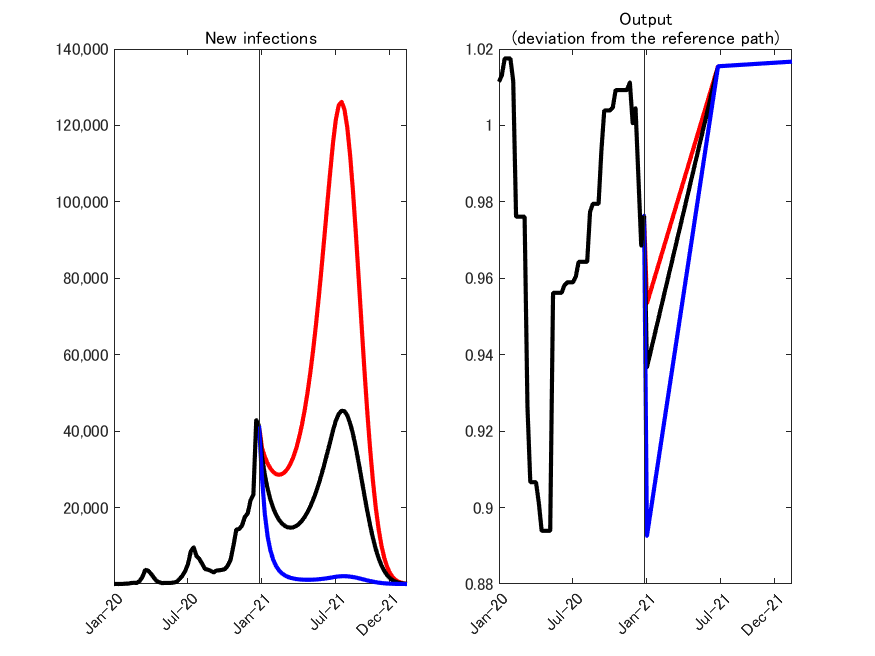

## Update on January 20, 2021

### 1. Conditional Projections of Covid-19

### 2. Forecast Errors

{: align="center"}
|    | Actual |  Projection  from last week |
| ---- | ---- | ---- |
| New Cases |  8000  |  7000  |
| New Deaths |  150  |  200  |

### 3. Projected relationship between Covid-19 and output

The code to generate the figures and tables are available at [./codes/]
