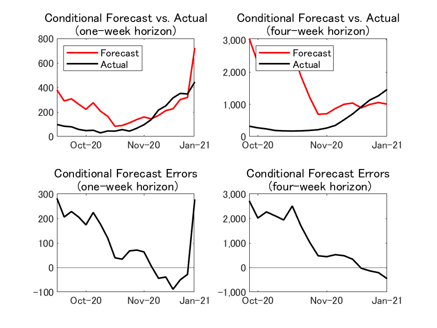

## Last update on January 21, 2021

Replications files are are available [here](https://github.com/Covid19OutputJapan/Covid19OutputJapan.github.io/tree/main/_archives/).

### 1. Conditional Projections of Covid-19

{: align="center"}
||

Source: Authors’ calculation.

### 2. Projected relationship between Covid-19 and output

{: align="center"}
||

Source: Authors’ calculation.  Note: The vertical axis shows the number of cumulative deaths by the end of the next 12 months. The horizontal dashed line indicates the total number of Covid-19 deaths during 2020.

### 3. Conditional Forecast Errors

#### New Deaths

{: align="center"}
||

#### New Cases

{: align="center"}
||

#### i. One-week horizon

{: align="center"}
|    | Actual | Conditional forecast  from last week | Conditional forecast Error |
| ---- | ---- | ---- | ---- |
| **New Cases** |  41,290  |  53,088  | 11,7983 |
| **New Deaths** |  445  |  723  | 278 |

#### ii. Four-week horizon

{: align="center"}
|    | Actual | Conditional forecast  from 4 weeks ago | Conditional forecast Error |
| ---- | ---- | ---- | ---- |
| **New Cases** |  129,454  |  83,138  | -46,315 |
| **New Deaths** |  1,459  |    1.004  | - 454 |

Source: Authors’ calculation.

### 5. Chart of the Week

{: align="center"}
||
