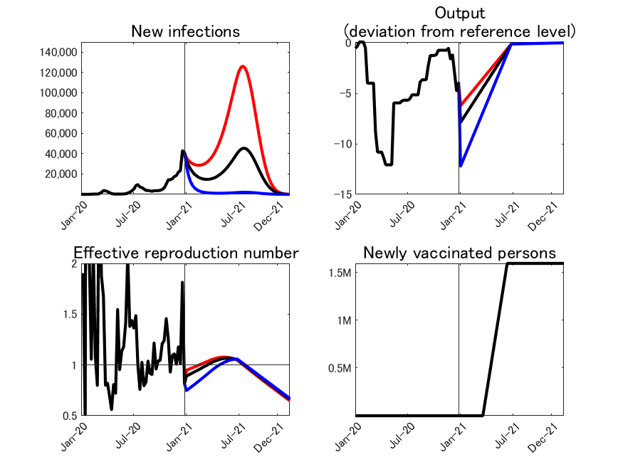
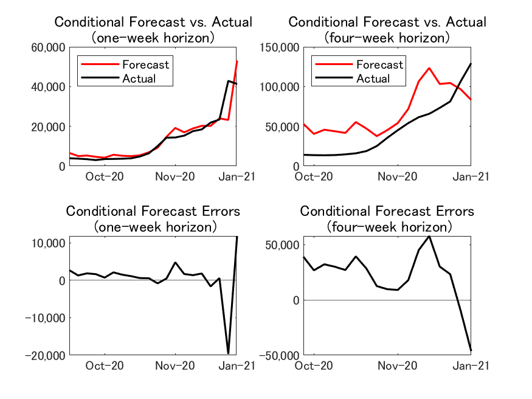

## Last update on January 21, 2021

Replications files are are available [here](https://github.com/Covid19OutputJapan/Covid19OutputJapan.github.io/tree/main/_archives/).

### 1. Conditional Projections of Covid-19

{: align="center"}
||

Source: Authors’ calculation. 
Note: Red line: Average output loss = 1.6%. Black line: Average output loss = 2%. Blue line: Average output loss = 3%.	

### 2. Projected relationship between Covid-19 and output

{: align="center"}
||

Source: Authors’ calculation. 
Note: The vertical axis shows the number of cumulative deaths by the end of the next 12 months. The horizontal axis shows the average output loss over the next twelve months. The horizontal dashed line indicates the total number of Covid-19 deaths during 2020.

### 3. Conditional Forecast Errors

#### New Cases

{: align="center"}
||

Source: Authors’ calculation.

#### New Deaths

{: align="center"}
||

Source: Authors’ calculation.

#### i. One-week horizon

{: align="center"}
|    | Conditional forecast  from last week |  Actual | Conditional forecast error |
| ---- | ---- | ---- | ---- |
| **New Cases** | 53,088   |  41,290  | 11,798 |
| **New Deaths** |   723  | 445  | 278 |

Source: Authors’ calculation.

#### ii. Four-week horizon

{: align="center"}
|    | Conditional forecast  from 4 weeks ago |  Actual | Conditional forecast error |
| ---- | ---- | ---- | ---- |
| **New Cases** |  83,138  |  129,454  | -46,315 |
| **New Deaths** |   1.004  |    1,459 | - 454 |

Source: Authors’ calculation.

### 5. Chart of the Week

{: align="center"}
||

Source: Authors’ calculation.
Note: The solid black line and grey fan chart are the same as in Chart 2. The red line is the relationship between the output loss and the number of and cumulative deaths if the pace of vaccine distribution is twice as fast as in the baseline case.
