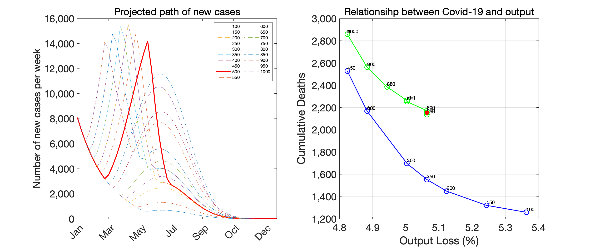
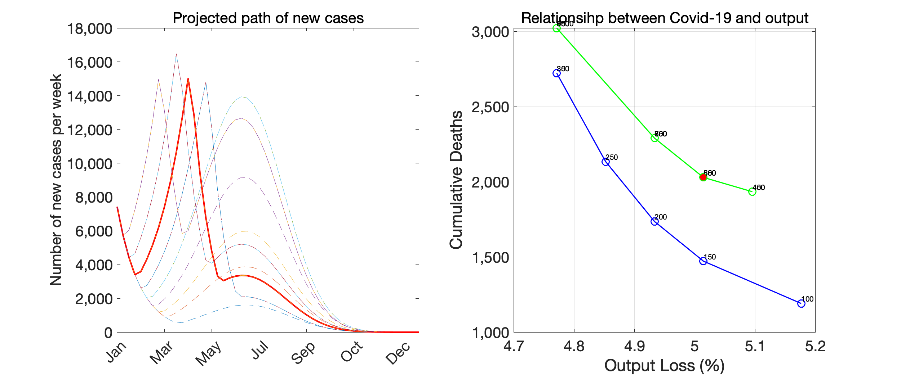
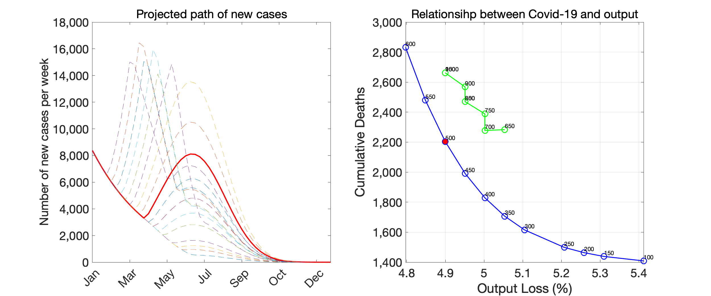
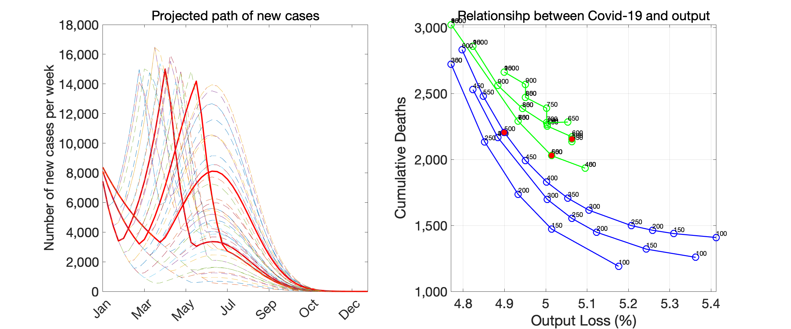

## Last update on January 21, 2021

The codes and datafiles to generate the figures and tables are available [here](https://github.com/Covid19OutputJapan/Covid19OutputJapan.github.io/tree/main/_archives/).

### 1. Baseline scenario

{: align="center"}
||

Source: Authors’ calculation.

### 2. Rapid-decline scenario

{: align="center"}
||

Source: Authors’ calculation

### 3. Gradual-decline scenario

{: align="center"}
||

Source: Authors’ calculation

### 4. All cases together

{: align="center"}
||

Source: Authors’ calculation
